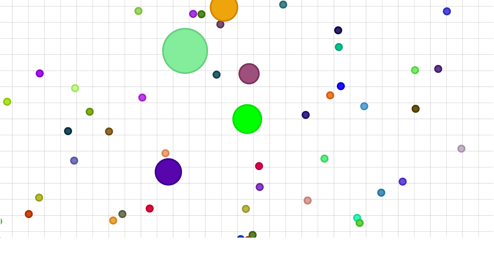

# IOGAME: agar.io Clone

This is an agar.io clone made in p5.js. Some of the code was originally written in Processing 3, which is why we chose p5.

Server (unfinished!) in Node.js, using Socket.io and Express

# How to play:

- Make sure Node.js is installed

- Run 'npm install express' in server folder

- Run 'node .' in server folder

- Go to localhost:3000 in your browser